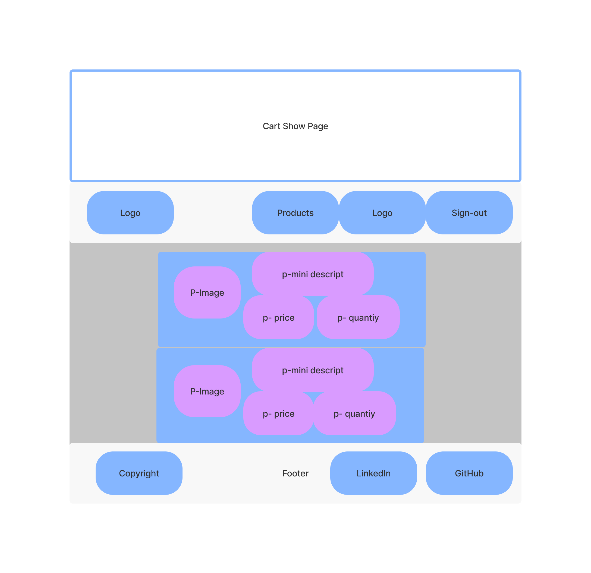

Shop App
- - - -

A web application that allows the customer to add selected products to cart. The cart functionanility is full CRUD.

Technologies Used
- - - -
* Frontend - HTML, CSS, Material CSS and Django(Opinionated Framework)
* Backend - Python
* Database - PSQL
* Deployment - Heroku

ERD

Initial wireframe for Index Page

Wireframe for Cart Show Page

Wireframe for Product Show Page

Getting Started
- - - -
Deployment - https://shop-for-balls.herokuapp.com/

Challenges
- - - -
- [ ] Hiding my Secret Key in .ENV

Future Enhancements
- - - -
- [ ] Add user authentication and authorization